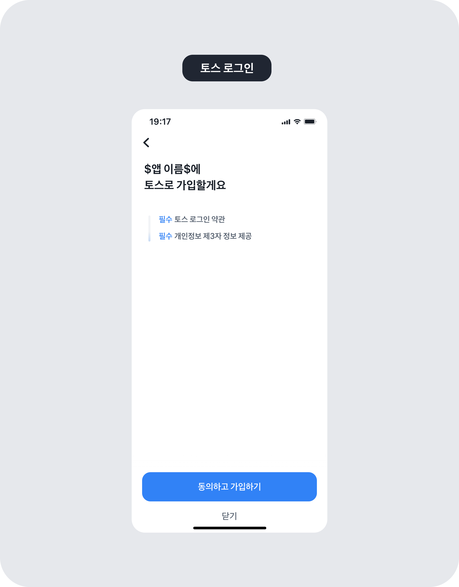

# react-native-toss

React Native wrapper for Toss Login SDK (iOS & Android)

[](https://www.npmjs.com/package/react-native-toss)
[](https://github.com/Soundok/react-native-toss/blob/main/LICENSE)

## 토스 로그인이란?

토스 로그인은 토스 계정으로 빠르고 안전하게 로그인할 수 있는 기능이에요.\
로그인 과정에서 사용자에게 어떤 정보 제공에 동의받을지 직접 설정할 수 있어요.\
또한 서비스를 운영하는 데 필요한 약관과 동의문, 연결 끊기 콜백 정보도 함께 등록할 수 있어요.

<p align="center">
  
</p>

## 요구 사항

| Platform | 최소 버전 |
|----------|----------|
| iOS      | 13.0     |
| Android  | 6.0 (API 23) |
| React Native | 0.75+ |

## 설치

```sh
npm install react-native-toss
# or
yarn add react-native-toss
```

### iOS

Toss iOS SDK는 `spm_dependency`를 통해 Swift Package Manager로 자동 설치됩니다.

Podfile에 `use_frameworks!`가 dynamic linking으로 설정되어 있어야 합니다:

```ruby
# ios/Podfile
use_frameworks! :linkage => :dynamic
```

설정 후 pod install을 실행하세요:

```sh
cd ios && pod install
```

#### 1. Info.plist 설정

토스앱 실행 가능 여부를 확인하기 위해 `Info.plist`에 다음을 추가하세요:

```xml
<key>LSApplicationQueriesSchemes</key>
<array>
  <string>supertoss</string>
</array>
```

#### 2. URL Scheme 설정

로그인 후 앱으로 돌아오기 위해 URL Scheme을 추가하세요:

**Xcode > [Info] > [URL Types] > [URL Schemes]** 에 `toss{YOUR_APP_KEY}` 입력

예: 앱 키가 `AB12CD34EF56GH78`이면 → `tossAB12CD34EF56GH78`

#### 3. AppDelegate 설정

`AppDelegate.swift`에 URL 콜백 처리를 추가하세요:

```swift
import TossLogin

// ...

func application(_ app: UIApplication, open url: URL, options: [UIApplication.OpenURLOptionsKey : Any] = [:]) -> Bool {
  if TossLoginController.shared.isCallbackURL(url) {
    return TossLoginController.shared.handleOpenUrl(url)
  }
  return false
}
```

**SceneDelegate를 사용하는 경우:**
```swift
import TossLogin

func scene(_ scene: UIScene, openURLContexts URLContexts: Set<UIOpenURLContext>) {
  if let url = URLContexts.first?.url, TossLoginController.shared.isCallbackURL(url) {
    _ = TossLoginController.shared.handleOpenUrl(url)
  }
}
```

### Android

`android/app/src/main/AndroidManifest.xml`에 인가 코드 수신을 위한 Activity를 추가하세요:

```xml
<activity
    android:name="com.vivarepublica.loginsdk.activity.TossAuthCodeHandlerActivity"
    android:exported="true"
    android:launchMode="singleTask">

    <intent-filter android:autoVerify="true">
        <action android:name="android.intent.action.VIEW" />
        <category android:name="android.intent.category.DEFAULT" />
        <category android:name="android.intent.category.BROWSABLE" />

        <data
            android:host="oauth"
            android:scheme="toss{YOUR_APP_KEY}" />
    </intent-filter>
</activity>
```

`{YOUR_APP_KEY}`를 실제 앱 키로 교체하세요.

> Toss Android SDK 의존성과 토스앱 설치 확인을 위한 `<queries>` 태그는 라이브러리에 포함되어 있어 별도 설정이 필요 없습니다.
> 만약 프로젝트에서 `repositoriesMode.set(RepositoriesMode.FAIL_ON_PROJECT_REPOS)`를 사용 중이라면, `settings.gradle`에 `maven { url 'https://jitpack.io' }`를 추가해주세요.

## 사용법

### 초기화

```tsx
import { TossLogin } from 'react-native-toss';

// 앱 시작 시 호출 (iOS, Android 모두 필수)
TossLogin.configure('YOUR_APP_KEY');
```

### 로그인

```tsx
import { TossLogin } from 'react-native-toss';

async function handleTossLogin() {
  // 토스앱 설치 여부 확인
  const available = await TossLogin.isLoginAvailable();

  if (!available) {
    // 토스앱 설치 유도 페이지로 이동
    TossLogin.moveToBridgePageForNoApp();
    return;
  }

  // 로그인 요청
  const result = await TossLogin.login();

  switch (result.type) {
    case 'success':
      console.log('Auth Code:', result.authCode);
      // authCode로 서버에서 accessToken을 발급받으세요
      break;
    case 'cancelled':
      console.log('사용자가 로그인을 취소했습니다.');
      break;
    case 'error':
      console.error(`에러: [${result.code}] ${result.message}`);
      break;
  }
}
```

> 전체 예제는 [example](example) 디렉토리를 참고하세요.

## API

### `TossLogin.configure(appKey: string): void`
SDK를 초기화합니다. iOS, Android 모두 필수입니다. 앱 시작 시 호출하세요.

### `TossLogin.isLoginAvailable(): Promise<boolean>`
토스앱이 설치되어 있고 로그인 가능한지 확인합니다.

### `TossLogin.login(policy?: string): Promise<TossLoginResult>`
토스 로그인을 요청합니다.

반환값 `TossLoginResult`:
```ts
type TossLoginResult =
  | { type: 'success'; authCode: string }
  | { type: 'cancelled' }
  | { type: 'error'; code: string; message: string };
```

### `TossLogin.moveToBridgePageForNoApp(): void`
토스앱 설치를 유도하는 페이지로 이동합니다.

### `TossLogin.handleOpenUrl(url: string): Promise<boolean>`
iOS에서 URL 콜백을 처리합니다. 일반적으로 AppDelegate에서 네이티브로 처리하므로 직접 호출할 필요가 없습니다.

## Types

```ts
import type {
  TossLoginResult,
  TossLoginSuccessResult,
  TossLoginErrorResult,
  TossLoginCancelledResult,
} from 'react-native-toss';
```

## 관련 문서

- [토스 로그인 연동 문서](https://developers-apps-in-toss.toss.im/login/store-login.html)

## Native SDKs

이 라이브러리는 아래 토스 공식 네이티브 SDK를 래핑합니다:

- iOS: [toss/toss-sdk-ios](https://github.com/toss/toss-sdk-ios)
- Android: [toss/toss-login-android-sdk](https://github.com/toss/toss-login-android-sdk)

## Contributing

- [Development workflow](CONTRIBUTING.md#development-workflow)
- [Sending a pull request](CONTRIBUTING.md#sending-a-pull-request)
- [Code of conduct](CODE_OF_CONDUCT.md)

## License

MIT
